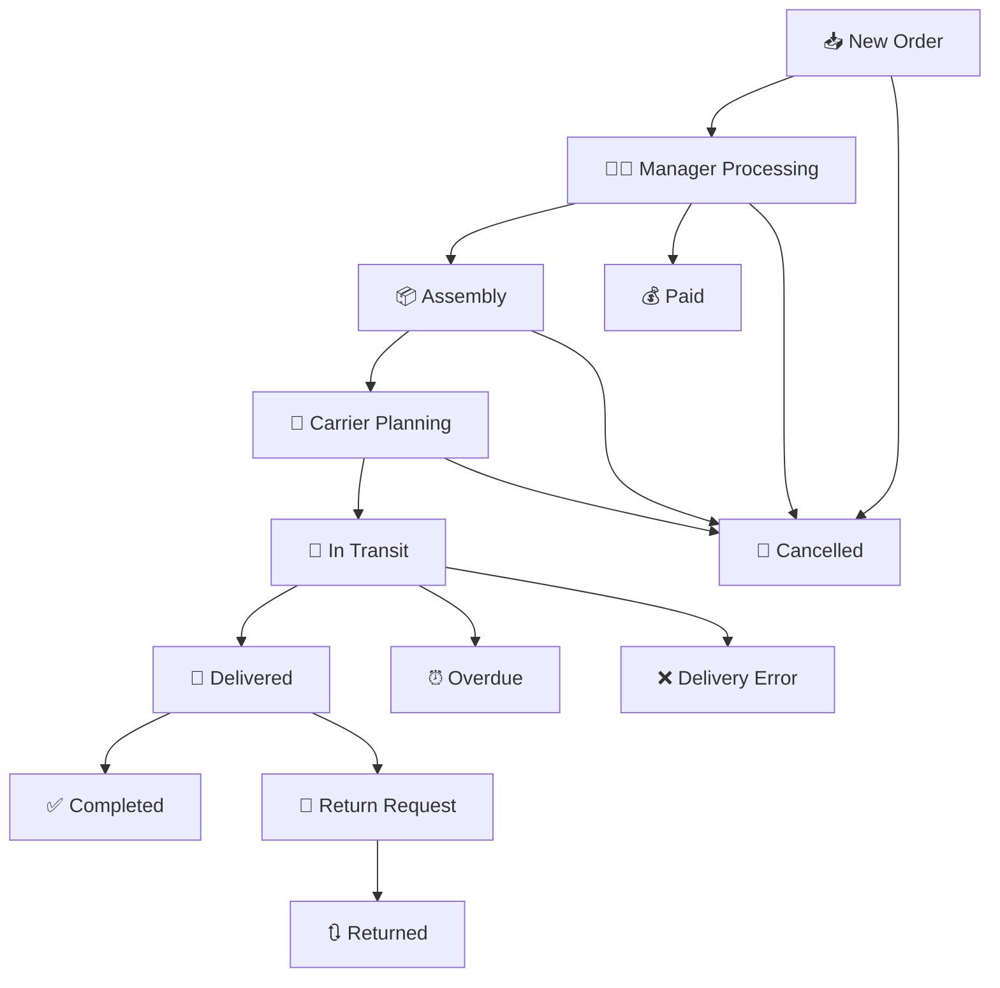

# 📊 Status Mapping Documentation

## Overview
This document outlines the comprehensive status mapping between marketplace-specific statuses and internal application statuses for the Order Management System.

---

## 🎯 Internal App Status Structure

### Current Statuses (Existing)
| Priority | Status Name | Description | Color |
|----------|-------------|-------------|-------|
| 1 | **Нове замовлення** | New order received | 🟦 Blue |
| 2 | **Обробляється менеджером** | Being processed by manager | 🟨 Yellow |
| 3 | **Комплектується** | Being assembled/packed | 🟧 Orange |
| 4 | **Заплановано передачу перевізнику** | Planned transfer to carrier | 🟪 Purple |
| 5 | **Доставляється** | Being delivered | 🟩 Green |
| 6 | **Скасовано** | Cancelled | 🟥 Red |

### New Statuses (To Be Added)
| Priority | Status Name | Description | Color |
|----------|-------------|-------------|-------|
| 7 | **Виконано** | Completed/Fulfilled | ✅ Dark Green |
| 8 | **Оплачено** | Paid | 💰 Gold |
| 9 | **Доставлено** | Delivered | 📦 Teal |
| 10 | **Прострочено** | Overdue | ⏰ Brown |
| 11 | **Помилка доставки** | Delivery error | ❌ Dark Red |
| 12 | **Повернено** | Returned | 🔄 Gray |
| 13 | **Запит на повернення** | Return request | 🔃 Light Gray |

---

## 🛍️ Marketplace Status Mappings

### 🔵 PromUa Status Mapping

| Marketplace Status | → | Internal App Status |
|-------------------|---|---------------------|
| `Новый` | → | **Нове замовлення** |
| `Принят` | → | **Обробляється менеджером** |
| `Выполнен` | → | **Виконано** |
| `Отменен` | → | **Скасовано** |
| `Оплаченный` | → | **Оплачено** |
| `Обробляється менеджером` | → | **Обробляється менеджером** |
| `Відправлено` | → | **Доставляється** |

---

### 🔴 Rozetka Status Mapping

| Marketplace Status | → | Internal App Status |
|-------------------|---|---------------------|
| `Нове замовлення` | → | **Нове замовлення** |
| `Комплектується. Дані підтверджені` | → | **Комплектується** |
| `Передано до служби доставки` | → | **Заплановано передачу перевізнику** |
| `Доставляється` | → | **Доставляється** |
| `Очікує в пункті самовивозу` | → | **Доставлено** |
| `Замовлення виконано` | → | **Виконано** |
| `Не оброблено продавцем протягом дня` | → | **Обробляється менеджером** |
| `Відправлення протерміновано` | → | **Прострочено** |
| `Не прийшов за замовленням` | → | **Скасовано** |
| `Відмова при отриманні` | → | **Скасовано** |
| `Скасовано адміністратором` | → | **Скасовано** |
| `Некоректна ТТН` | → | **Помилка доставки** |
| `Немає в наявності/ брак` | → | **Скасовано** |
| `Не влаштовують умови оплати` | → | **Скасовано** |
| `Не вдалося зв'язатися` | → | **Скасовано** |
| `Замовлення повернено` | → | **Повернено** |
| `Товар не підходить за характеристиками` | → | **Скасовано** |
| `Скасування. Не влаштовує доставка` | → | **Скасовано** |
| `Тестове замовлення` | → | **Скасовано** |
| `Обробляється менеджером` | → | **Обробляється менеджером** |

---

### 🟢 Epicentr Status Mapping

| Marketplace Status | → | Internal App Status |
|-------------------|---|---------------------|
| `Новий` | → | **Нове замовлення** |
| `Підтверджено продавцем` | → | **Обробляється менеджером** |
| `Підтверджено` | → | **Комплектується** |
| `Відправлено` | → | **Доставляється** |
| `Доставлено` | → | **Доставлено** |
| `Завершено` | → | **Виконано** |
| `Закрито` | → | **Виконано** |
| `Скасовано` | → | **Скасовано** |
| `Повернено` | → | **Повернено** |
| `Запит на повернення` | → | **Запит на повернення** |
| `Скасовано продавцем` | → | **Скасовано** |
| `Завершено (відмова продавця)` | → | **Скасовано** |
| `Закрито (відмова продавця)` | → | **Скасовано** |

---

## 🔄 Order Processing Flow

### 📋 Status Flow Description

1. **📥 Start**: All marketplace orders enter as **"Нове замовлення"**
2. **👨‍💼 Manager Processing**: Orders move to **"Обробляється менеджером"** when manager starts processing
3. **📦 Assembly**: Confirmed orders move to **"Комплектується"** when products are being prepared
4. **🚚 Carrier Planning**: Assembled orders move to **"Заплановано передачу перевізнику"** when ready for shipment
5. **🚛 In Transit**: Orders move to **"Доставляється"** when handed to delivery service
6. **📍 Delivered**: Orders move to **"Доставлено"** when successfully delivered to customer
7. **✅ Completed**: Orders move to **"Виконано"** when fully processed and customer satisfied

### 🔀 Alternative Flows

- **💰 Payment Track**: Orders can be marked as **"Оплачено"** when payment is confirmed
- **⏰ Delays**: Orders can be marked as **"Прострочено"** when delayed beyond expected delivery
- **❌ Delivery Issues**: Orders can be marked as **"Помилка доставки"** when delivery problems occur
- **🔄 Returns**: Orders can be marked as **"Запит на повернення"** or **"Повернено"** for return processes
- **🚫 Cancellations**: Orders can be marked as **"Скасовано"** at any stage for various reasons

---

## 🚀 Implementation Notes

> **Important**: When implementing the new statuses, ensure all marketplace API mappings are configured correctly in the `StatusMapping` component.

### Required Actions:
- [ ] Add 7 new internal statuses to the database
- [ ] Configure marketplace code mappings for each status
- [ ] Update status priority order (1-13)
- [ ] Test status synchronization with all marketplaces
- [ ] Update UI components to handle new statuses

### Marketplace API Codes:
Each internal status needs to be mapped to the corresponding marketplace API codes:
- **PromUa**: Uses string-based status codes
- **Rozetka**: Uses numeric status IDs  
- **Epicentr**: Uses string-based status identifiers

---

## 📈 Status Priority Order

| Priority | Status |
|----------|--------|
| 1 | Нове замовлення |
| 2 | Обробляється менеджером |
| 3 | Комплектується |
| 4 | Заплановано передачу перевізнику |
| 5 | Доставляється |
| 6 | Виконано |
| 7 | Оплачено |
| 8 | Доставлено |
| 9 | Прострочено |
| 10 | Помилка доставки |
| 11 | Повернено |
| 12 | Запит на повернення |
| 13 | Скасовано |

---

*Last updated: [Current Date]*
*Version: 1.0*
