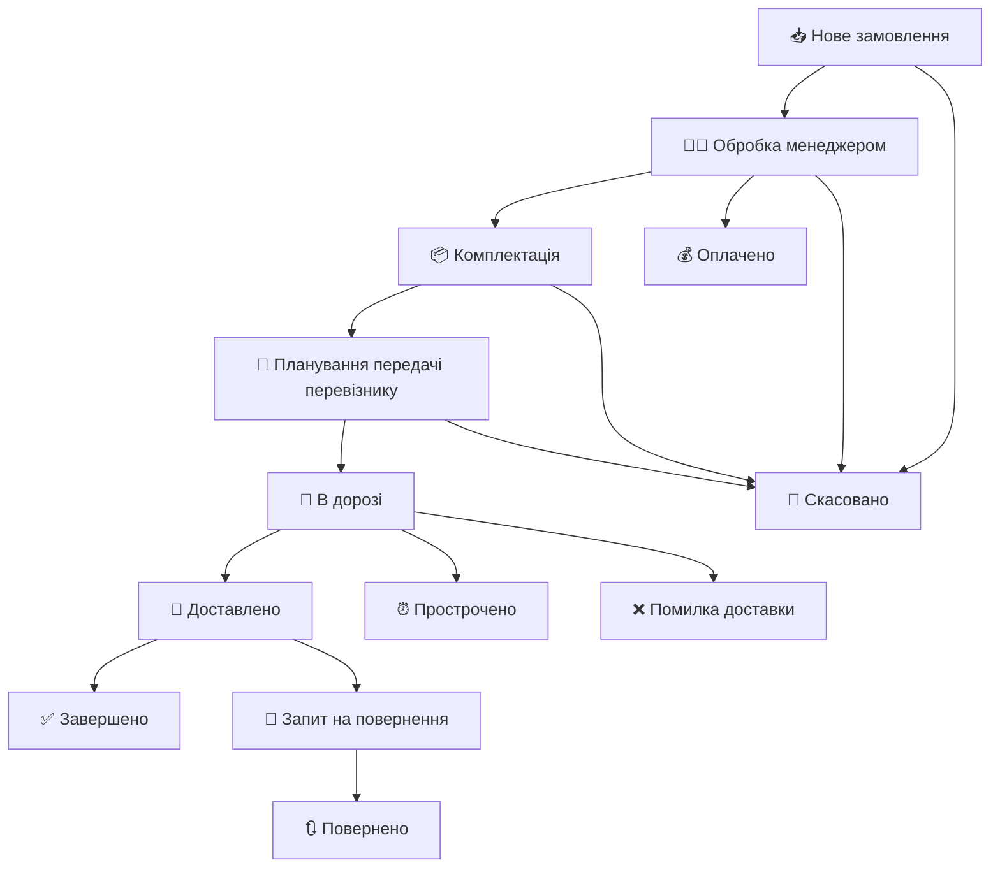

# 📊 Документація з картування статусів

## Огляд
Цей документ описує комплексне картування між статусами специфічними для маркетплейсів та внутрішніми статусами додатку для Системи управління замовленнями.

---

## 🎯 Структура внутрішніх статусів додатку

### Поточні статуси (Існуючі)
| Пріоритет | Назва статусу | Опис | Колір |
|----------|-------------|-------------|-------|
| 1 | **Нове замовлення** | Нове замовлення отримано | 🟦 Синій |
| 2 | **Обробляється менеджером** | Обробляється менеджером | 🟨 Жовтий |
| 3 | **Комплектується** | Збирається/пакується | 🟧 Помаранчевий |
| 4 | **Заплановано передачу перевізнику** | Заплановано передачу перевізнику | 🟪 Фіолетовий |
| 5 | **Доставляється** | Доставляється | 🟩 Зелений |
| 6 | **Скасовано** | Скасовано | 🟥 Червоний |

### Нові статуси (Для додавання)
| Пріоритет | Назва статусу | Опис | Колір |
|----------|-------------|-------------|-------|
| 7 | **Виконано** | Завершено/Виконано | ✅ Темно-зелений |
| 8 | **Оплачено** | Оплачено | 💰 Золотий |
| 9 | **Доставлено** | Доставлено | 📦 Бірюзовий |
| 10 | **Прострочено** | Прострочено | ⏰ Коричневий |
| 11 | **Помилка доставки** | Помилка доставки | ❌ Темно-червоний |
| 12 | **Повернено** | Повернено | 🔄 Сірий |
| 13 | **Запит на повернення** | Запит на повернення | 🔃 Світло-сірий |

---

## 🛍️ Картування статусів маркетплейсів

### 🔵 Картування статусів PromUa

| Статус маркетплейсу | → | Внутрішній статус додатку |
|-------------------|---|---------------------|
| `Новый` | → | **Нове замовлення** |
| `Принят` | → | **Обробляється менеджером** |
| `Выполнен` | → | **Виконано** |
| `Отменен` | → | **Скасовано** |
| `Оплаченный` | → | **Оплачено** |
| `Обробляється менеджером` | → | **Обробляється менеджером** |
| `Відправлено` | → | **Доставляється** |

---

### 🔴 Картування статусів Rozetka

| Статус маркетплейсу | → | Внутрішній статус додатку |
|-------------------|---|---------------------|
| `Нове замовлення` | → | **Нове замовлення** |
| `Комплектується. Дані підтверджені` | → | **Комплектується** |
| `Передано до служби доставки` | → | **Заплановано передачу перевізнику** |
| `Доставляється` | → | **Доставляється** |
| `Очікує в пункті самовивозу` | → | **Доставлено** |
| `Замовлення виконано` | → | **Виконано** |
| `Не оброблено продавцем протягом дня` | → | **Обробляється менеджером** |
| `Відправлення протерміновано` | → | **Прострочено** |
| `Не прийшов за замовленням` | → | **Скасовано** |
| `Відмова при отриманні` | → | **Скасовано** |
| `Скасовано адміністратором` | → | **Скасовано** |
| `Некоректна ТТН` | → | **Помилка доставки** |
| `Немає в наявності/ брак` | → | **Скасовано** |
| `Не влаштовують умови оплати` | → | **Скасовано** |
| `Не вдалося зв'язатися` | → | **Скасовано** |
| `Замовлення повернено` | → | **Повернено** |
| `Товар не підходить за характеристиками` | → | **Скасовано** |
| `Скасування. Не влаштовує доставка` | → | **Скасовано** |
| `Тестове замовлення` | → | **Скасовано** |
| `Обробляється менеджером` | → | **Обробляється менеджером** |

---

### 🟢 Картування статусів Epicentr

| Статус маркетплейсу | → | Внутрішній статус додатку |
|-------------------|---|---------------------|
| `Новий` | → | **Нове замовлення** |
| `Підтверджено продавцем` | → | **Обробляється менеджером** |
| `Підтверджено` | → | **Комплектується** |
| `Відправлено` | → | **Доставляється** |
| `Доставлено` | → | **Доставлено** |
| `Завершено` | → | **Виконано** |
| `Закрито` | → | **Виконано** |
| `Скасовано` | → | **Скасовано** |
| `Повернено` | → | **Повернено** |
| `Запит на повернення` | → | **Запит на повернення** |
| `Скасовано продавцем` | → | **Скасовано** |
| `Завершено (відмова продавця)` | → | **Скасовано** |
| `Закрито (відмова продавця)` | → | **Скасовано** |

---

## 🔄 Потік обробки замовлень

## 📈 Порядок пріоритетів статусів

| Пріоритет | Статус |
|----------|--------|
| 1 | Нове замовлення |
| 2 | Обробляється менеджером |
| 3 | Комплектується |
| 4 | Заплановано передачу перевізнику |
| 5 | Доставляється |
| 6 | Виконано |
| 7 | Оплачено |
| 8 | Доставлено |
| 9 | Прострочено |
| 10 | Помилка доставки |
| 11 | Повернено |
| 12 | Запит на повернення |
| 13 | Скасовано |

---

*Останнє оновлення: [Поточна дата]*
*Версія: 1.0*
